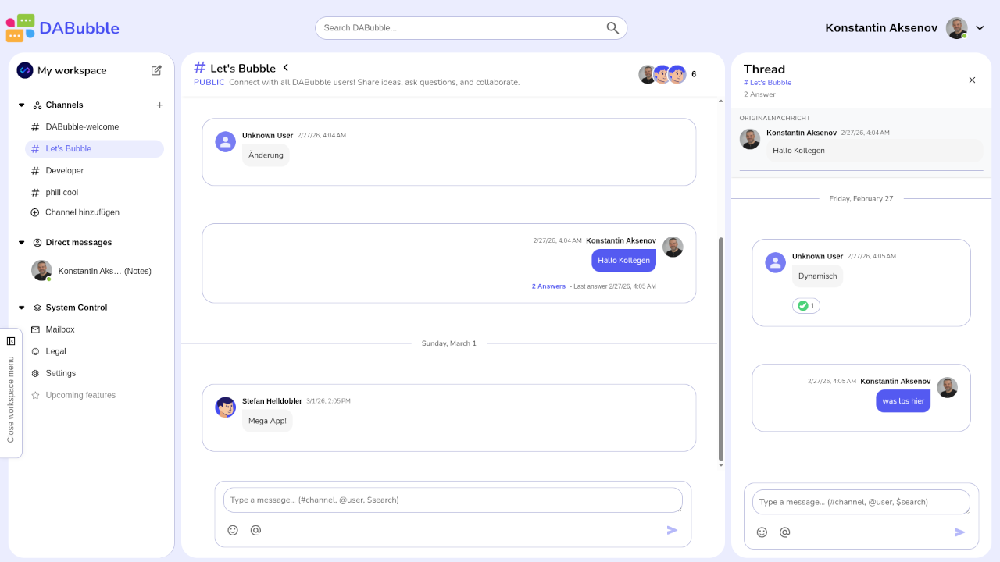
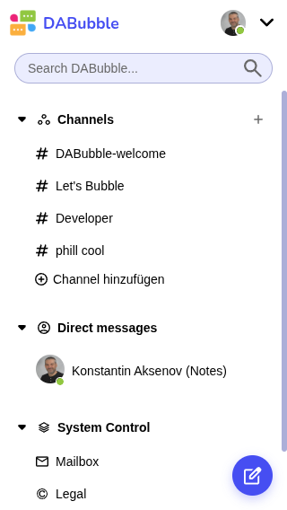

# DABubble – Discord Clone Chat App

[](https://angular.io/)
[](https://www.typescriptlang.org/)
[](https://firebase.google.com/)
[](https://sass-lang.com/)
[](LICENSE)

A modern, real-time chat application inspired by Discord, built with Angular 21, Firebase, and TypeScript. Features channels, direct messages, threads, reactions, and user management.

---

## Live Demo

**[dabubble.dev2k.org](https://dabubble.dev2k.org)**

---

## Preview

### Desktop View



### Mobile View



---

## Features

### User Account & Administration

- ✅ **User Registration** – Email/password with avatar selection
- ✅ **User Login** – Secure authentication with Firebase
- ✅ **Google OAuth** – Login with Google (Popup strategy)
- ✅ **Password Recovery** – Reset password via email
- ✅ **Profile Editing** – Update name and avatar
- ✅ **Auth Guards** – Route protection (auth, no-auth, avatar-selection)
- 🔜 **Online Status** – Real-time user presence (planned)

### Channels & Direct Messages

- ✅ **Channels** – Group discussions with multiple members
- ✅ **Channel Management** – Create, edit, manage channels
- ✅ **Direct Messages** – Private 1:1 conversations
- ✅ **Message Display** – Grouped by date with avatars
- ✅ **Emoticon Reactions** – React to messages with emojis
- ✅ **Threads** – Reply to specific messages in separate threads
  - Thread count display on parent messages
  - Last reply timestamp
  - Parent message shown in thread
  - Reactive loading with signals
- ✅ **Mention Users** – Tag members with `@username` (planned)
- ✅ **Mention Channels** – Reference channels with `#channel` (planned)
- ✅ **Search Messages** – Find messages across channels and DMs (planned)
- ✅ **Emoticons in Messages** – Emoji picker integration (planned)

### Channel Management

- ✅ **Create Channels** – Set name, description
- ✅ **Channel List** – Sidebar navigation with mailbox
- ✅ **Workspace UI** – Header with search, sidebar with channels/DMs
- ✅ **Add Members** – Invite users to existing channels (planned)
- ✅ **Leave Channels** – Exit channels you don't need (planned)
- ✅ **Edit Channels** – Modify name and description (planned)
- 🔜 **Duplicate Prevention** – No duplicate channel names (planned)

---

## Tech Stack

**Frontend**

- Angular 21 (Standalone Components, Signals, Zoneless)
- TypeScript 5.9 (Strict mode, isolatedModules)
- SCSS (BEM Methodology)
- RxJS 7.8
- NgRx SignalStore (State Management)

**Backend & Database**

- Firebase Authentication (Email/Password, Google OAuth Popup)
- Cloud Firestore (NoSQL Database)
- Firebase Storage (File uploads)
- Real-time listeners

**Code Quality**

- TypeScript Strict Mode
- ESLint & Prettier
- JSDoc Documentation
- Max 14 lines per function
- Max 400 LOC per file (general)

**DevOps & Hosting**

- GitHub (Version Control)
- Firebase Hosting (Reference)
- IONOS Apache Hosting (Production: dabubble.dev2k.org)
- .htaccess SPA routing configuration

---

## Project Structure

```
dabubble/
├── .github/
│   ├── prompts/
│   │   ├── angular/                                       # Angular dev guides (modular)
│   │   │   ├── 01-coding-standards.md                     # Function rules, naming, Git
│   │   │   ├── 02-component-structure.md                  # Component patterns, signals
│   │   │   ├── 03-state-management.md                     # NgRx SignalStore
│   │   │   ├── 04-styling-bem.md                          # BEM methodology, SCSS
│   │   │   ├── 05-firebase-integration.md                 # Firebase patterns
│   │   │   ├── 06-architecture.md                         # Thread system, auth flow
│   │   │   ├── 07-quality-checklist.md                    # Code quality checklist
│   │   │   └── README.md                                  # Guide navigation
│   │   ├── copilot-project.prompt.md                      # Project requirements
│   │   └── README.md                                      # Prompts overview
│   └── workflows/
│       └── deploy.yml                                     # CI/CD Pipeline (future)
├── public/
│   ├── favicon.ico
│   ├── manifest-dark.webmanifest                          # PWA manifest (dark)
│   ├── manifest-light.webmanifest                         # PWA manifest (light)
│   └── img/                                               # Public images & icons
├── src/
│   ├── app/
│   │   ├── core/                                          # Singleton Services, Guards, Models
│   │   │   ├── components/                                # Core Layout Components
│   │   │   │   ├── auth-layout/                           # Auth Pages Layout Wrapper
│   │   │   │   ├── header/                                # Auth Header Component
│   │   │   │   └── footer/                                # Auth Footer Component
│   │   │   ├── guards/                                    # Route Guards
│   │   │   │   ├── auth.guard.ts                          # Protect authenticated routes
│   │   │   │   ├── no-auth.guard.ts                       # Redirect if authenticated
│   │   │   │   └── avatar-selection.guard.ts              # Avatar selection guard
│   │   │   ├── interceptors/                              # HTTP interceptors
│   │   │   ├── models/                                    # Domain Models
│   │   │   │   ├── user.model.ts                          # User entity
│   │   │   │   ├── channel.model.ts                       # Channel entity
│   │   │   │   ├── message.model.ts                       # Message entity
│   │   │   │   ├── invitation.model.ts                    # Invitation entity
│   │   │   │   ├── thread.model.ts                        # Thread entity
│   │   │   │   └── direct-message.model.ts                # Direct message entity
│   │   │   └── services/                                  # Core Services
│   │   │       ├── firebase/                              # Firebase Services
│   │   │       │   ├── firebase.service.ts                # Firebase initialization
│   │   │       │   └── heartbeat.service.ts               # User presence heartbeat
│   │   │       ├── invitation/                            # Invitation Management
│   │   │       │   └── invitation.service.ts              # Channel/DM invitations
│   │   │       ├── reaction/                              # Message Reactions
│   │   │       │   └── reaction.service.ts                # Emoji reactions
│   │   │       ├── unread/                                # Unread Messages
│   │   │       │   └── unread.service.ts                  # Unread tracking
│   │   │       ├── store-cleanup.service.ts               # Store cleanup on logout
│   │   │       └── i18n/                                  # Internationalization
│   │   ├── features/                                      # Feature Modules (Business Logic)
│   │   │   ├── auth/                                      # Authentication Feature
│   │   │   │   ├── components/                            # Auth-specific components
│   │   │   │   │   ├── login-form/
│   │   │   │   │   ├── signup-form/
│   │   │   │   │   ├── password-reset/
│   │   │   │   │   └── avatar-selection/
│   │   │   │   └── pages/                                 # Auth pages
│   │   │   │       ├── login-page/
│   │   │   │       ├── signup-page/
│   │   │   │       └── avatar-selection-page/
│   │   │   │
│   │   │   ├── dashboard/                                 # Main Dashboard Feature (Channels, DMs, Threads)
│   │   │   │   ├── components/                            # Dashboard components
│   │   │   │   │   ├── channel-conversation/              # Channel message display
│   │   │   │   │   ├── channel-mailbox/                   # Invitation mailbox & management
│   │   │   │   │   ├── channal-welcome/                   # Channel welcome screen
│   │   │   │   │   ├── chat-new-msg/                      # New DM conversation
│   │   │   │   │   ├── chat-private/                      # Private DM message display
│   │   │   │   │   ├── thread/                            # Thread conversation view
│   │   │   │   │   ├── workspace-header/                  # Dashboard header with search
│   │   │   │   │   └── workspace-sidebar/                 # Channel/DM sidebar navigation
│   │   │   │   └── pages/                                 # Dashboard pages
│   │   │   │       └── dashboard.component.ts             # Main dashboard orchestrator
│   │   │   │
│   │   │   └── legal/                                     # Legal Pages
│   │   │       └── pages/                                 # Legal page components
│   │   │           ├── imprint/
│   │   │           ├── privacy/
│   │   │           └── terms/
│   │   │
│   │   ├── layout/                                        # Layout Components
│   │   │   ├── auth-layout/                               # Auth pages layout wrapper
│   │   │   ├── main-layout/                               # Main app layout (post-auth)
│   │   │   ├── header/                                    # App header component
│   │   │   ├── sidebar/                                   # Navigation sidebar
│   │   │   └── footer/                                    # App footer component
│   │   │
│   │   ├── shared/                                        # Shared/Reusable Components
│   │   │   ├── components/                                # Reusable UI components
│   │   │   │   ├── back-button/                           # Back navigation button
│   │   │   │   ├── cancel-button/                         # Cancel action button
│   │   │   │   ├── checkbox-field/                        # Checkbox input component
│   │   │   │   ├── conversation-messages/                 # Reusable message list component
│   │   │   │   ├── dabubble-logo/                         # App logo component
│   │   │   │   ├── guest-button/                          # Guest login button
│   │   │   │   ├── input-field/                           # Form input component
│   │   │   │   ├── language-switcher/                     # i18n language switcher
│   │   │   │   ├── legal-information/                     # Footer legal links
│   │   │   │   ├── link-button/                           # Link-style button
│   │   │   │   ├── primary-button/                        # Primary CTA button
│   │   │   │   ├── reaction-bar/                          # Message reactions component
│   │   │   │   └── secondary-button/                      # Secondary action button
│   │   │   └── animations/                                # Shared animations
│   │   │       └── slide.animations.ts                    # Slide animations
│   │   │
│   │   ├── stores/                                        # NgRx SignalStore (State Management)
│   │   │   ├── auth/                                      # Auth Store (Modular Structure)
│   │   │   │   ├── auth.store.ts                          # Main store orchestrator
│   │   │   │   ├── auth.types.ts                          # State interface & initial state
│   │   │   │   ├── auth.helpers.ts                        # Mapper & utility functions
│   │   │   │   ├── auth.login.methods.ts                  # Login methods (Email, Google Popup)
│   │   │   │   ├── auth.signup.methods.ts                 # Signup & verification
│   │   │   │   ├── auth.password.methods.ts               # Password reset/recovery
│   │   │   │   └── index.ts                               # Barrel export
│   │   │   ├── channel.store.ts                           # Channel mcleanup on logout
│   │   │   │   ├── auth.login.methods.ts                  # Login methods (Email, Google Popup)
│   │   │   │   ├── auth.signup.methods.ts                 # Signup & verification
│   │   │   │   ├── auth.password.methods.ts               # Password reset/recovery
│   │   │   │   └── index.ts                               # Barrel export
│   │   │   ├── channel.store.ts                           # Channel management store
│   │   │   ├── channel-member.store.ts                    # Channel membership store
│   │   │   ├── channel-message.store.ts                   # Channel messages store (auto-cleanup)
│   │   │   ├── direct-message.store.ts                    # DM conversations & messages (auto-cleanup)
│   │   │   ├── thread.store.ts                            # Thread replies store (auto-cleanup)
│   │   │   ├── mailbox.store.ts                           # Mailbox messages store (auto-cleanup)
│   │   │   ├── message.store.ts                           # Message CRUD store
│   │   │   ├── user.store.ts                              # User management store (auto-cleanup)
│   │   │   ├── user-presence.store.ts                     # User online/offline status
│   │   │   └── store.utils.ts                             # Store utility functions
│   ├── config/
│   │   └── environments/                                  # Environment configs
│   │       ├── env.dev.ts                                 # Dev config (not in Git)
│   │       ├── env.dev.example.ts                         # Dev template
│   │       ├── env.prod.ts                                # Prod config (not in Git)
│   │       └── env.prod.example.ts                        # Prod template
│   ├── styles/                                            # Global SCSS
│   │   ├── _variables.scss                                # CSS custom properties
│   │   ├── _mixins.scss                                   # All mixins (imports below)
│   │   ├── _mixins-breakpoints.scss                       # Responsive breakpoint mixins
│   │   ├── _mixins-buttons.scss                           # Button style mixins
│   │   ├── _mixins-flexbox.scss                           # Flexbox utilities
│   │   ├── _mixins-layout.scss                            # Layout mixins
│   │   ├── _mixins-typography.scss                        # Typography mixins
│   │   ├── _mixins-utilities.scss                         # General utility mixins
│   │   ├── _fonts.figtree.scss                            # Figtree font-face
│   │   ├── _fonts.nunito.scss                             # Nunito font-face
│   │   ├── _layout.scss                                   # Layout utilities
│   │   └── _typography.scss                               # Typography styles
│   ├── index.html                                         # HTML entry point
│   ├── main.ts                                            # Application bootstrap
│   └── styles.scss                                        # Global styles entry
├── dfirebaserc                                            # Firebase project configuration
├── firebase.json                                          # Firebase hosting configuration
├── firestore.rules                                        # Firestore security rules
├── firestore.indexes.json                                 # Firestore composite indexes
├── storage.rules                                          # Cloud Storage security rules
├── .gitignore                                             # Git ignore rules (excludes env.*.ts)
├── angular.json                                           # Angular workspace config
├── package.json                                           # Dependencies & scripts
├── tsconfig.json                                          # TypeScript config
├── tsconfig.app.json                                      # App-specific TS config
├── angular.json                                           # Angular workspace config
├── package.json                                           # Dependencies & scripts
├── tsconfig.json                                          # TypeScript config
├── tsconfig.app.json                                      # App-specific TS config
└── README.md                                              # This file
```

---

## Architecture

### Modular NgRx SignalStore Pattern

DABubble uses a **modular store structure** for complex features like authentication:

```
stores/auth/
├── auth.store.ts              # Main store orchestrator
├── auth.types.ts              # State interface & initial state
├── auth.helpers.ts            # Mappers & state handlers
├── auth.login.methods.ts      # Login methods
├── auth.signup.methods.ts     # Signup methods
├── auth.password.methods.ts   # Password methods
└── index.ts                   # Barrel export
```

**Benefits:**

- ✅ Single Responsibility: Each file has one clear purpose
- 🔜 Testability: Methods can be tested in isolation (planned)
- ✅ Maintainability: Changes affect only relevant files
- ✅ Scalability: Easy to add new features

---

### Authentication Flow

**Google OAuth Strategy: Popup (Not Redirect)**

DABubble uses `signInWithPopup()` for Google authentication instead of `signInWithRedirect()`:

```typescript
// auth.login.methods.ts
async loginWithGoogle(): Promise<void> {
  const provider = new GoogleAuthProvider();
  await signInWithPopup(auth, provider);  // ✅ Popup approach
}
```

**Why Popup?**

- ✅ Better user experience (no page reload)
- ✅ Works reliably on all hosting providers (Firebase, IONOS, etc.)
- ✅ No complex redirect handling or sessionStorage flags
- ✅ Immediate navigation after successful login

**Production Hosting: IONOS Apache**

Production deployment at [dabubble.dev2k.org](https://dabubble.dev2k.org) uses IONOS Apache hosting with `.htaccess` configuration for SPA routing

---

### Thread System Architecture

**Slack-Style Threading Implementation**

DABubble implements a complete thread system where users can reply to specific messages in separate conversation threads:

```typescript
// Data Flow: Message → Parent Component → Dashboard → Thread
User clicks thread icon
  ↓
ConversationMessages emits threadClicked(messageId)
  ↓
Parent finds message and emits threadRequested({ messageId, parentMessage })
  ↓
Dashboard sets threadInfo signal
  ↓
ThreadComponent reactively loads via effect()
  ↓
Thread panel slides in from right
```

**Key Features:**

- ✅ Thread count displayed on parent messages
- ✅ Last reply timestamp shown
- ✅ Parent message included in thread view
- ✅ Reactive loading with `effect()` watching signals
- ✅ Structured event communication pattern
- ✅ Ready for Firebase migration

**Components:**

- **ThreadComponent** – Thread display with parent + replies
- **ConversationMessagesComponent** – Reusable message list
- **Dashboard** – Orchestrates thread opening/closing

---

## User Stories (Implementation Status)

- [x] User registration with email/password/google
- [x] User login with authentication
- [ ] Password recovery via email
- [ ] Profile editing
- [x] Online status

### ✅ Channels & Direct Messages

- [x] Direct messaging between users
- [x] React to messages with emoticons
- [x] Send messages with emoticons
- [x] Create threads on messages
- [x] Mention users with `@`
- [x] Mention channels with `#`
- [x] Search messages in the chats

### ✅ Channel Management

- [x] Create new channels
- [x] Add members to channels
- [x] Leave channels
- [x] Edit channel details
- [ ] Prevent duplicate channel names

---

## Getting Started

### Prerequisites

- Node.js 18+ and npm
- Angular CLI 21+
- Firebase account
- Git

### Installation

1. **Clone the repository**

```bash
git clone https://github.com/YOUR_USERNAME/dabubble.git
cd dabubble
```

2. **Install dependencies**

```bash
npm install
```

3. **Configure Firebase**

Copy the example environment files:

```bash
cp src/config/environments/env.dev.example.ts src/config/environments/env.dev.ts
cp src/config/environments/env.prod.example.ts src/config/environments/env.prod.ts
```

Edit `env.dev.ts` with your Firebase credentials:

```typescript
export const env = {
  production: false,
  firebase: {
    apiKey: 'YOUR_API_KEY',
    authDomain: 'your-project.firebaseapp.com',
    projectId: 'your-project-id',
    storageBucket: 'your-project.appspot.com',
    messagingSenderId: '123456789',
    appId: '1:123456789:web:abcdef',
  },
};
```

4. **Start development server**

```bash
npm start
```

Navigate to `http://localhost:4200/`

---

## Development

### Available Scripts

```bash
npm start          # Start dev server (port 4200)
npm run build      # Build for production
npm run watch      # Build with watch mode
npm test           # Run unit tests
ng generate        # Generate components/services/etc.
```

### Code Standards

- **Functions:** Max 14 lines, one task per function
- **Files:** Max 100 LOC for modular stores, max 400 LOC for general files
- **Naming:** camelCase for variables/functions, PascalCase for classes/components
- **Types:** TypeScript strict mode, isolatedModules: true, no `any`
- **Docs:** JSDoc comments for all public methods
- **CSS:** BEM naming convention
- **Stores:** Modular structure for complex features (auth/)
- **Exports:** Use `export type` for interfaces (isolatedModules requirement)

---

## MCP Server (AI Integration)

DABubble ships an [MCP (Model Context Protocol)](https://modelcontextprotocol.io) server in the `mcp/` directory. It lets AI assistants like **Claude Desktop**, **Cursor**, or **VS Code Copilot** read and write DABubble data directly.

### Available tools

| Tool | Description |
|------|-------------|
| `list_channels` | List all channels |
| `get_channel_messages` | Read recent messages from a channel |
| `send_channel_message` | Post a message to a channel |
| `list_users` | List all users |
| `get_user` | Get a user's profile by UID |
| `list_direct_message_conversations` | List DM conversations for a user |
| `get_direct_messages` | Read recent DM messages |
| `send_direct_message` | Post a DM message |
| `search_messages` | Keyword search across all channels |

See **[mcp/README.md](mcp/README.md)** for full setup and configuration instructions.

---

## Security

- Firebase Authentication for user management
- Firestore Security Rules for data protection
- Input validation and sanitization
- XSS protection
- CORS configuration
- Environment variables for secrets

---

## Contributing

This is a student project. Contributions are not currently accepted, but feel free to fork and customize!

---

## License

This project is licensed under the MIT License.

---

## Author

**Konstantin Aksenov**

- Portfolio: [portfolio.dev2k.org](https://portfolio.dev2k.org)
- LinkedIn: [LinkedIn](https://www.linkedin.com/in/konstantin-aksenov-802b88190/)
- GitHub: [@KosMaster87](https://github.com/KosMaster87)
- Email: konstantin.aksenov@dev2k.org

---

## Acknowledgments

- Developer Akademie for the project foundation
- Angular Team for the amazing framework
- Firebase for backend services
